#  2025 텐서플로우 롤 데이터 분석과제

**조원:** 우정광, 김준성, 이장헌  

---

## 1.  피쳐 선정 철학 및 근거 (Feature Selection Rationale)

본 프로젝트는 **리그 오브 레전드(League of Legends)** 경기 전체의 데이터를 **시계열 모델**로 분석하여,
14분을 기준으로 나누어 
각 플레이어의 **초반 주도권 확보 능력** 및 **운영 능력**을 객관적으로 평가하는 것을 목표로 한다.
개인의 역량이 돋보이는 라인전에서의 능력과 팀적인 움직임에 관련된 역량이 다르기 때문에 분리하여 분석하기로 하였다.

---

### 1.1  챔피언 특성 뭉개기 (Normalization for Champion Heterogeneity)

챔피언마다 기본 능력치, 스킬셋, 성장곡선, 역할군(예: 캐리형 vs. 탱커형, 초반 강캐 vs. 후반 성장형)이 크게 다르기 때문에  
단순히 절대 수치(CS 80개, 딜량 5000 등)로는 공정한 비교가 불가능하다.

이를 해결하기 위해 다음 두 가지 **보정 전략**을 적용하였다.

####   차이 지표 활용 (Difference Metrics)

- `현재 체력 차이(t)`, `경험치 차이(t)` 등은 **상대 플레이어와의 상대적 우위**를 직접적으로 표현한다.  
- 이는 챔피언의 특성이나 상성과 무관하게, **동일 시간대에 더 우세한 상태**를 수치적으로 보여주는 객관적 지표이다.  
- 예를 들어, 초반 라인전에서 상대보다 경험치가 높거나 체력이 더 높다면, **라인전 주도권을 확보한 것**으로 간주할 수 있다.

####  분당 지표 활용 (Per-Minute Normalization)

- `CS(t)`나 `입힌 피해량(t)` 등 주요 성과 지표를 **분당 단위**로 계산하여,  
  경기 시간의 길이 차이로 인한 왜곡을 제거했다.  
- LSTM 모델은 시간에 따른 패턴을 학습하므로,  
  **시간(t) 피쳐와 결합하여 성장 곡선이나 변화율을 학습**할 수 있도록 설계했다.  
- 이를 통해 챔피언마다 다른 성장속도나 스파이크 타이밍을 평균화하여 **공정한 비교 기반**을 마련했다.

---

### 1.2  KDA (킬/데스/어시스트) 지표의 재해석 및 한계 보완
####  KDA의 역할

- **KDA는 초반 주도권이 실제 골드 및 스노우볼링으로 이어졌는지를 검증하는 보조 스코어**로 활용된다.  
- 즉, 교전에서의 성과가 골드나 오브젝트 이득으로 전이되었는지를 확인하는 성과 지표(Outcome Indicator)의 역할을 한다.

####  KDA의 한계와 보완 전략

- KDA가 낮다고 해서 플레이어의 기여도가 반드시 낮은 것은 아니다.  
  예를 들어, 킬이 없더라도 **타워 방패를 파괴하거나 챔피언 외 피해량이 높다면**,  
  이는 라인전 주도권을 확보하기 위한 적극적인 행동(Action)을 의미한다.
- 따라서 본 프로젝트에서는 KDA 외에 행동 기반 지표(Behavioral Metrics)를 함께 사용하여  
  “결과만 좋은 플레이”보다 “주도적으로 경기를 만든 플레이”를 더 높게 평가하도록 모델을 설계했다.

예시:  
> 킬이 없더라도 **타워 방패를 다 뜯고, 상대 체력 차이를 크게 벌린 플레이어**는  
> 모델에서 높은 라인전 평가 점수를 받을 수 있다.

---

 **요약하자면**, 본 프로젝트의 피쳐 설계는  
- **시간 정규화(Time Normalization)**  
- **상대 비교(Relative Difference)**  
- **행동 중심(Action-Oriented) 평가**  
세 가지 철학을 기반으로, **LSTM 시계열 학습에 최적화된 구조로 설계**되었다.

#  피처(Feature) 선정 근거 및 이론적 배경

본 프로젝트의 목표는 “각 포지션별로 얼마나 ‘1인분’을 했는가”를 정량적으로 평가하는 것이다.  
이를 위해 단순 승패가 아닌 **개인 기여도 및 라인전 우위 여부를 측정할 수 있는 지표들**을 선정하였다.  

---

##  탑 (Top)

| 피처 | 설명 | 선정 근거 |
|:----|:----|:----|
| **CS(t)** | 분당 미니언 처치 수 | 라인전 단계에서의 **골드 수급 능력**을 가장 직접적으로 반영. 상성이나 교전보다 **‘파밍 안정성’과 라인 관리 능력**을 평가할 수 있음. |
| **타워방패** | 파괴한 방패 개수 | **라인 주도권**과 **압박 능력**을 나타냄. Riot 공식 API에서도 **골드 보상 지표**로 직접 환산 가능. 초반 라인전 우세 판단에 매우 유의미함. |
| **경험치(t)** | 분당 경험치 획득량 | 라인을 비우지 않고 **효율적으로 유지**했는지 측정. 경험치 차이는 **라인전 유지력과 리스크 관리 능력**을 반영함. |
| **현재 체력 차이(t)** | 상대와의 체력 차이 | **딜교환의 우위**를 직접적으로 측정. 추가적으로 위치 데이터와 결합하면 **귀환·탱킹 여부까지 고려** 가능. 체력 차이는 **실질적 교전 성과 지표**로 중요. 추가 분석 근거: 위치 정보(좌표)를 결합하여, 체력 차이가 라인전 승리로 인한 것인지 혹은 라인전 패배 후 우물 복귀로 인한 일시적 차이인지 구분하여 플레이어에게 가산점을 부여할 수 있습니다.|
| **입힌 피해량(t)** | 분당 입힌 피해량 | 챔피언간 교전 참여도 및 **전투 효율성**을 반영. 단순 CS 외의 **교전 중심 지표**. |
| **챔피언 외 피해량(t)** | 타워/미니언 피해량 | **라인 압박력과 타워 푸쉬 성향**을 반영. 특히 탑은 솔로라인으로, 타워 피해량이 **라인전 주도권의 핵심 지표**. |
| **KDA** | 킬/데스/어시스트 비율 | 팀 전체에 기여하는 정도를 단순 수치화. 단, 초반 데이터에서는 킬이 적기 때문에 **보조적 지표로 활용**. |

 **근거 요약:**  
- 탑은 독립적인 라인전이 길기 때문에, **CS/타워방패/체력 차이**가 주요한 성과 판단 기준이다.  
- Riot Games의 Match API에서도 "Lane Dominance" 지표를 구성할 때 유사한 변수들을 사용함.  
- KDA는 결과보다는 **리스크 관리 능력(데스 최소화)** 평가용으로 사용.

---

##  미드 (Mid)

| 피처 | 설명 | 선정 근거 |
|:----|:----|:----|
| **CS(t)** | 분당 미니언 처치 수 | 파밍 효율은 **골드 수급과 아이템 타이밍**에 직결되며, 미드의 핵심 성장 지표. |
| **경험치(t)** | 분당 경험치 획득량 | 미드는 로밍과 라인 복귀 빈도가 높아 **라인 유지력과 성장 효율성**을 판단 가능. |
| **현재 체력 차이(t)** | 상대와의 체력 차이 | **딜교환의 우위**를 직접적으로 측정. 추가적으로 위치 데이터와 결합하면 **귀환·탱킹 여부까지 고려** 가능. 체력 차이는 **실질적 교전 성과 지표**로 중요. 추가 분석 근거: 위치 정보(좌표)를 결합하여, 체력 차이가 라인전 승리로 인한 것인지 혹은 라인전 패배 후 우물 복귀로 인한 일시적 차이인지 구분하여 플레이어에게 가산점을 부여할 수 있습니다.|
| **입힌 피해량(t)** | 챔피언에게 입힌 피해 | 스킬 활용 능력 및 **전투 관여도** 판단 가능. 딜링형 챔피언의 기량 지표로 활용. |
| **챔피언 외 피해량(t)** | 타워/미니언 피해량 | 라인 압박력 및 **웨이브 관리 능력**을 나타냄. |
| **KDA** | 킬/데스/어시스트 | 미드는 교전 중심 지역이므로 **초반 킬 관여도**가 성장 곡선에 큰 영향을 미침. |

 **근거 요약:**  
- 미드는 **교전 중심 포지션**이므로 체력 차이, 피해량, KDA가 중요.  
- 경험치와 CS는 **성장 속도 및 스킬 파워 타이밍 지표**로 필수.

---

##  정글 (Jungle)

| 피처 | 설명 | 선정 근거 |
|:----|:----|:----|
| **CS(t)** | 정글 캠프 처치 수 | **경험치와 골드 수급 효율**을 직접 반영. 상대 정글과 비교 시 **동선 효율성 판단** 가능. |
| **경험치(t)** | 분당 경험치 획득량 | **리드 정글과의 격차 분석**에 핵심. 동선 최적화 및 캠프 리셋 관리 능력 판단. |
| **KDA** | 킬/데스/어시스트 | **갱킹 성공률**과 팀 기여도를 수치화. 특히 어시스트 비중이 중요. |
| **오브젝트 처치** | 드래곤/전령 등 관여 횟수 | **팀 전반 영향력**을 반영. 단순 개인 성장 외의 **매크로 판단력 지표**. |
| **시야점수** | 와드 설치 및 파괴 수 | 정글러의 **시야 장악력과 정보 제공 능력**을 수치화. 프로 경기 분석에서도 핵심 매트릭스. |

 **근거 요약:**  
- 정글은 라인전보다 **맵 전체 영향력과 팀 기여도**를 중심으로 평가.  
- Riot API와 OP.GG 등에서도 **오브젝트 관여율, 시야점수**를 핵심 정글 평가 지표로 사용.

---

##  바텀 (Bottom; ADC + Support)

| 피처 | 설명 | 선정 근거 |
|:----|:----|:----|
| **CS(t)** | 원딜의 분당 미니언 처치 수 | 원딜의 **성장 효율**을 나타내며, 골드 수급의 핵심 지표. |
| **경험치(t)** | 분당 경험치 획득량 | 두 명이 함께 있기 때문에, **라인 유지력과 포지셔닝 효율**을 측정 가능. |
| **타워방패** | 타워 방패 파괴 수 | 라인전 주도권을 측정. **딜교환/압박력/로밍 타이밍 확보 능력**에 직결. |
| **현재 체력 차이(t)** | 상대와의 체력 차이 | **딜교환의 우위**를 직접적으로 측정. 추가적으로 위치 데이터와 결합하면 **귀환·탱킹 여부까지 고려** 가능. 체력 차이는 **실질적 교전 성과 지표**로 중요. 추가 분석 근거: 위치 정보(좌표)를 결합하여, 체력 차이가 라인전 승리로 인한 것인지 혹은 라인전 패배 후 우물 복귀로 인한 일시적 차이인지 구분하여 플레이어에게 가산점을 부여할 수 있습니다.|
| **입힌 피해량(t)** | 챔피언에게 입힌 피해 | **교전 적극성 및 딜 효율성** 반영. 원딜/서폿 모두에 해당. |
| **챔피언 외 피해량(t)** | 미니언/타워 피해량 | 라인 푸쉬 및 압박 주도권 판단. |
| **KDA** | 킬/데스/어시스트 | 교전 참여도와 생존력, 팀 기여도 반영. |
| **시야점수** | 와드 설치 및 제거 수 | **서포터의 기여도**를 직접 반영하는 핵심 지표. |

 **근거 요약:**  
- 바텀은 **2인 조합 포지션**으로, **라인전 협동성과 시야 장악 능력**이 중요.  
- 특히 **ADC는 CS 중심**, **서포터는 시야점수 중심**으로 구분하여 기여도 산출.

---

##  종합 피처 선정 논리

| 구분 | 핵심 평가 목적 | 대표 피처 |
|:----|:----|:----|
| **성장 지표** | 골드 및 경험치 기반 성장 효율 | CS, 경험치 |
| **라인전 우위 지표** | 교전/푸쉬 등 국소적 우위 | 체력 차이, 입힌 피해량, 타워방패 |
| **팀 기여 지표** | 한타 및 맵 단위 영향 | KDA, 오브젝트, 시야점수 |

---

# 군집화
기여도를 측정하기에 앞서 우리가 선정한 피쳐들을 토대로 kmeans를 이용해 각 라인별로 군집화를 시도하였다. k의 개수를 정하는 것은 엘보우 기법을 적용한 kneed 라이브러리를 이용해 자동으로 선정하였다. 14분 이전과 이후로 피쳐를 나누어 사용하였다. 군집화를 실행한 이유는 같은 기여도라도 사람마다 캐릭터의 차이와 플레이스타일이 다르기 때문에 군집화를 통해 그것을 알아내기 위함이다.

군집화 이후에 해당 군집의 중요 컬럼을 몇 개 뽑아서 해다 군집의 특성을 구분하였다.

### top의 그룹별 클러스터링 결과
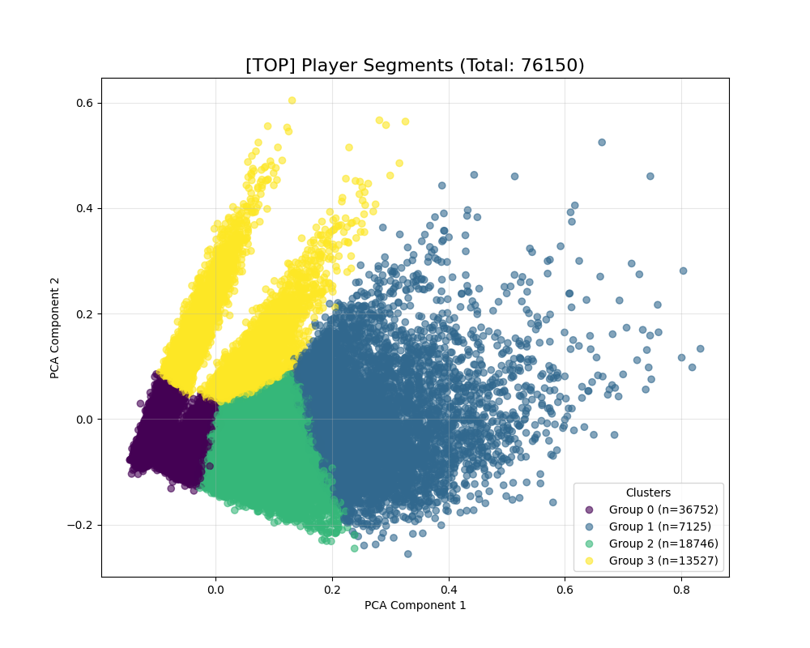
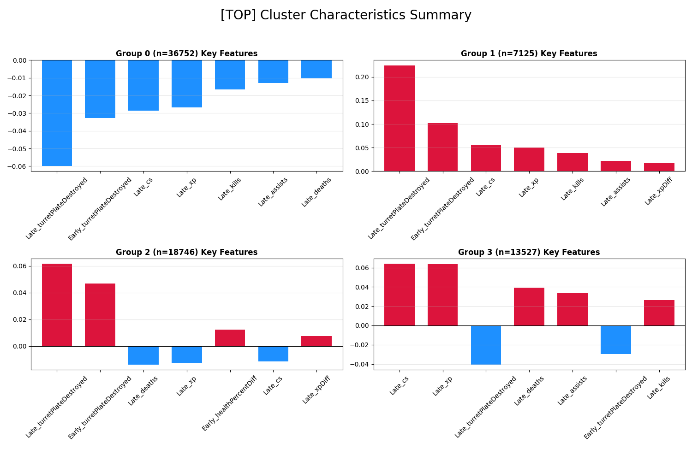
| 그룹 | 설명 | 건수 |
|:----|:----|:----|
| **그룹 0** | 전체적으로 못한 부류 | 36752건 (48.3%) |
| **그룹 1** | 전제척으로 잘한 부류 | 7125건 (9.4%) |
| **그룹 2** | 초반에 잘하고 후반에 못한 부류| 18746건 (24.6%) |
| **그룹 3** | 초반에 못하고 후반에 잘한 부류 | 13527건 (17.8%) |

### jug의 그룹별 클러스터링 결과
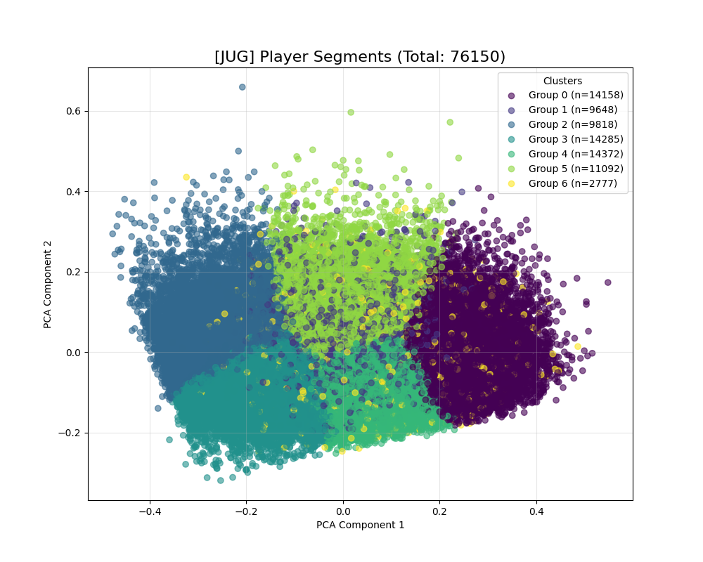
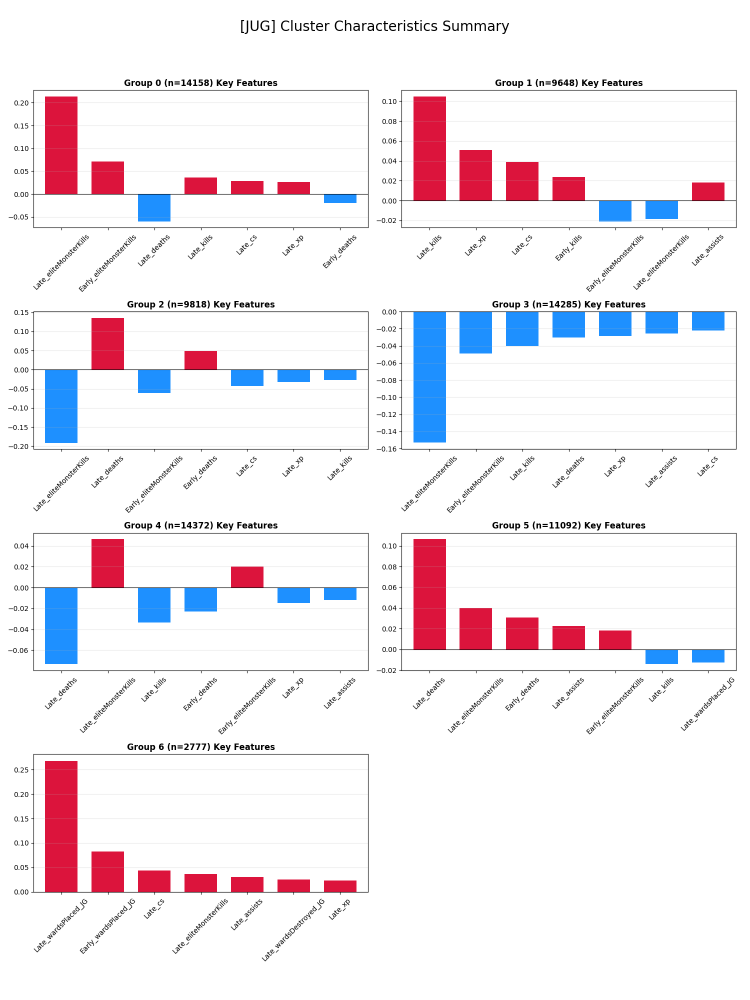
| 그룹 | 설명 | 건수 |
|:----|:----|:----|
| **그룹 0** | 전체적으로 잘한 부류 | 14158건 (18.6%) |
| **그룹 1** | 갱킹 위주로 잘한 부류 | 9648건 (12.7%) |
| **그룹 2** | 전체적으로 못한 부류 | 9818건 (12.9%) |
| **그룹 3** | 전체적으로 영향이 적은 부류 | 14285건 (18.8%) |
| **그룹 4** | 오브젝트 위주인 부류 | 14372건 (18.9%)
| **그룹 5** | 많이 죽는 오브젝트 위주인 부류  | 11092건 (14.6%) |
| **그룹 6** | 시야를 잘 잡는 부류 | 2777건 (3.6%) |

### mid의 그룹별 클러스터링 결과
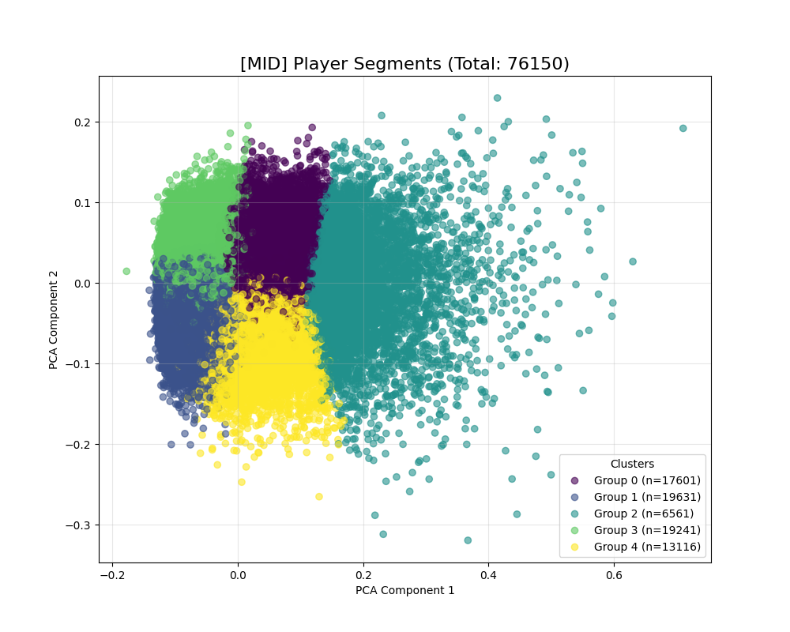
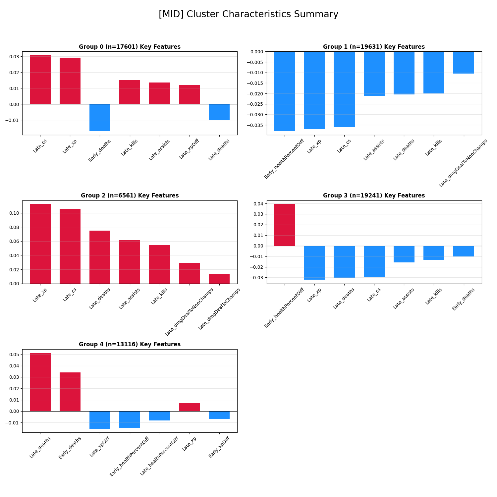
| 그룹 | 설명 | 건수 |
|:----|:----|:----|
| **그룹 0** | 전체적으로 잘하는 부류 | 17601건 (23.1%) |
| **그룹 1** | 전체적으로 못하는 부류 | 19631건 (25.8%) |
| **그룹 2** | 초반에 못하고 후반에 잘한 부류 | 6561건 (8.6%) |
| **그룹 3** | 초반에 잘하고 후반에 못한 부류 | 19241건 (25.3%) |
| **그룹 4** | 많이 죽는 부류 | 13116건 (17.2%) |

### bot의 그룹별 클러스터링 결과
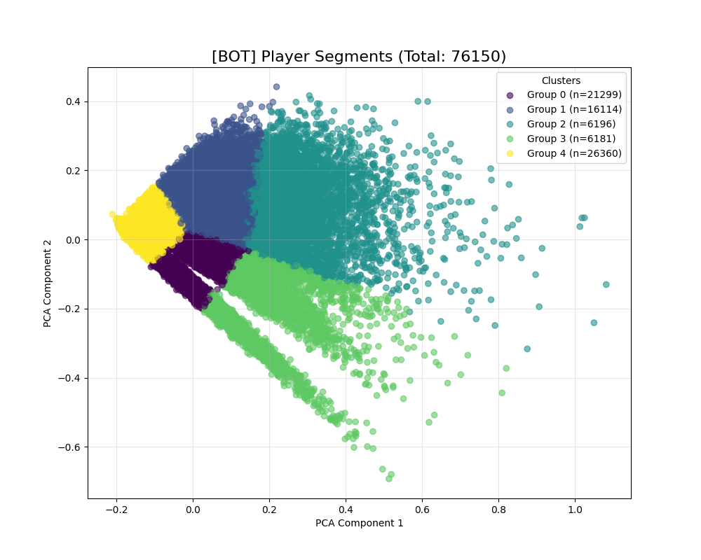
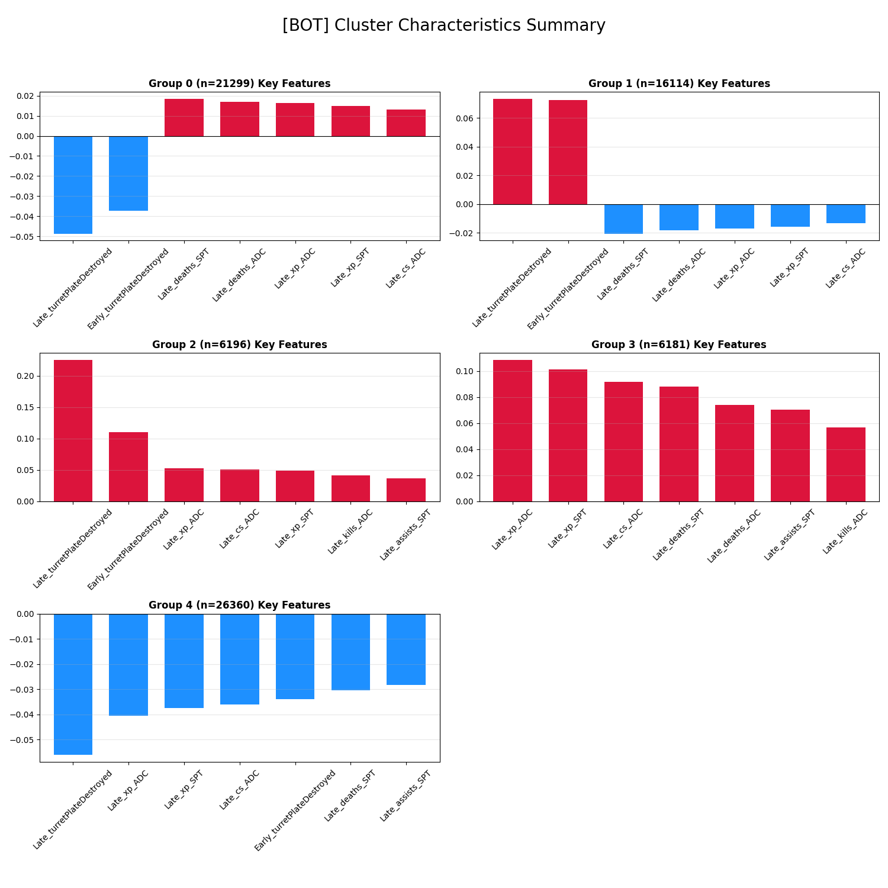
| 그룹 | 설명 | 건수 |
|:----|:----|:----|
| **그룹 0** | 초반에 못하고 후반에 잘한 부류 | 21299건 (28.0%) |
| **그룹 1** | 초반에 잘하고 후반에 못한 부류 | 16114건 (21.2%) |
| **그룹 2** | 초반에 잘하고 후반에 약간 잘한 부류 | 6196건 (8.1%) |
| **그룹 3** | 전체적으로 잘한 부류 | 6181건 (8.1%) |
| **그룹 4** | 전체적으로 못한 부류 | 26360건 (34.6%) |

----

# 기여도 산출 공식
 기여도 산출 공식 (Contribution Scoring Formula)
 1. 변수 정의$t$: 게임 시간 (분, minutes)$P_t$: 모델이 예측한 해당 플레이어의 $t$ 시점 성과 (Predicted Value from LSTM)$B_t$: 해당 라인의 전체 유저 $t$ 시점 중앙값 (Baseline Median Value)$R_t$: $t$ 시점의 순간 기여 효율 (Ratio)2. 순간 기여 효율 (Instantaneous Contribution Ratio)매 분($t$)마다 플레이어의 성과가 기준값 대비 몇 배인지 계산합니다.$$R_t = \frac{P_t}{B_t}$$(단, $B_t \approx 0$인 경우, $R_t = 1.0$으로 처리하여 0으로 나누는 오류 방지)3. 구간별 기여도 점수 (Aggregated Contribution Score)우리는 이 $R_t$를 14분(포탑 방패 소멸 시점)을 기준으로 나누어 평균을 구했습니다.A. 전체 기여도 (Total Score)$$Score_{total} = \frac{1}{T} \sum_{t=0}^{T} R_t$$(여기서 $T$는 게임이 진행된 총 시간)B. 초반 라인전 기여도 (Early Game Score, $t < 14$)$$Score_{early} = \frac{1}{14} \sum_{t=0}^{13} R_t$$C. 후반 운영 기여도 (Late Game Score, $t \ge 14$)$$Score_{late} = \frac{1}{T-14} \sum_{t=14}^{T} R_t$$ 식의 의미 : $Score = 1.0$: 해당 구간에서 딱 **평균(1인분)**만큼 플레이함. $Score > 1.0$ (예: 1.2): 평균적인 선수보다 20% 더 높은 효율로 골드/경험치를 수급하며 우위를 점함. $Score < 1.0$ (예: 0.8): 평균 대비 80% 수준의 퍼포먼스로, 상대에게 밀리거나 성장이 지체됨.

# 모델 선정 과정
## lstm모델 생성

우리가 선정한 데이터를 정규화를 적용해 학습시켜 사용하였다.
각 라인별로 lstm모델을 생성하여 현 시점의 성장 기대치를 예측하게 하였다.
10회 동안 성능 향상이 없으면 조기 종료하게 하였다.
중앙값을 척도로 얼마나 더 잘하였는지를 나타낸다.

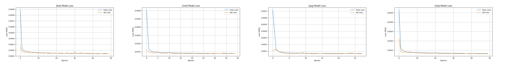

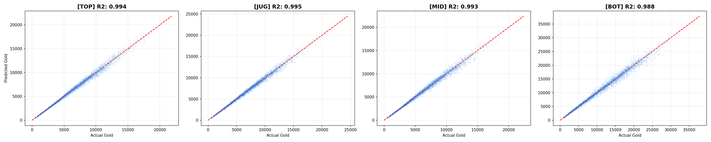
해당 모델로 게임 하나를 분석하게 하였다. 다음은 중앙값을 기준으로 얼마나 잘했는지를 판단한 결과이다.

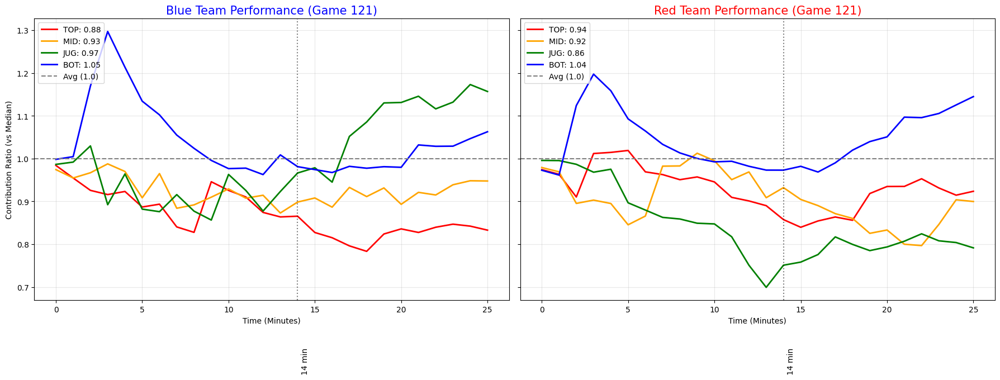
LSTM 모델이 예측한 스코어를 기반으로, 팀 전체 성능 합계에서 개인이 차지하는 상대적 비중을 산출하였다.

 ---

## LightGBM 모델 생성  
LSTM과 동일하며, 다른 점은 모델 학습 과정에서  
샘플을 추출해 먼저 학습한 뒤 가장 효과적인 학습 패턴을 파악하고,  
그 후 메인 데이터를 학습시켰다는 점이다.
중앙값을 척도로 얼마나 더 잘하였는지를 나타낸다.

### 잔차도  

### 정확도  

### 1인분 달성도  

LightGBM은 매우 빠른 학습 속도를 자랑하며 메모리 관리도 쉽다는 장점이 있다.  
하지만 적은 데이터를 사용할 경우 과적합이 쉽게 발생하는 단점도 있다.

---

## 모델 선정  
시계열 관련 학습 모델은 LSTM이 더 좋은 성능을 보이고,  
학습 속도와 메모리 관리는 LightGBM이 더 빠르다는 것을 알 수 있다. 
우리는 lstm을 사용하기로 결정하였다.

# 그룹별 기여도 산정

분류한 그룹별 평균 기여도를 산정하고자 한다. 같은 플레이스타일로 분류된 것들을 초반과 후반을 분리하여 평균 내었다.
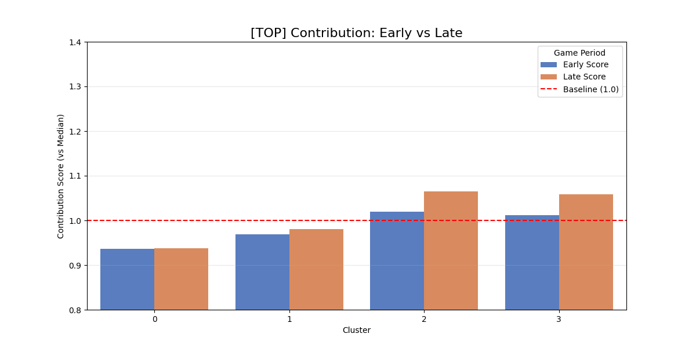
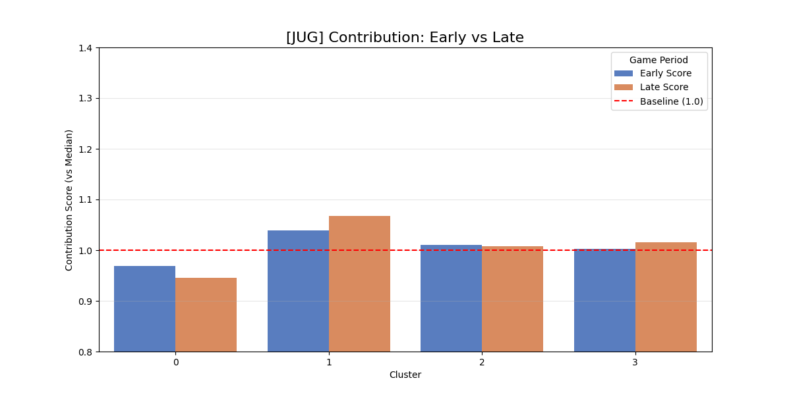
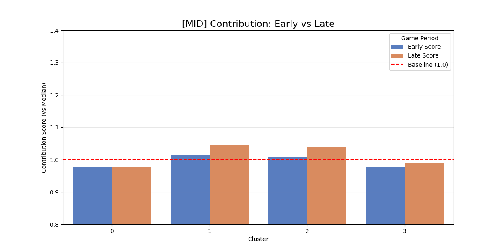
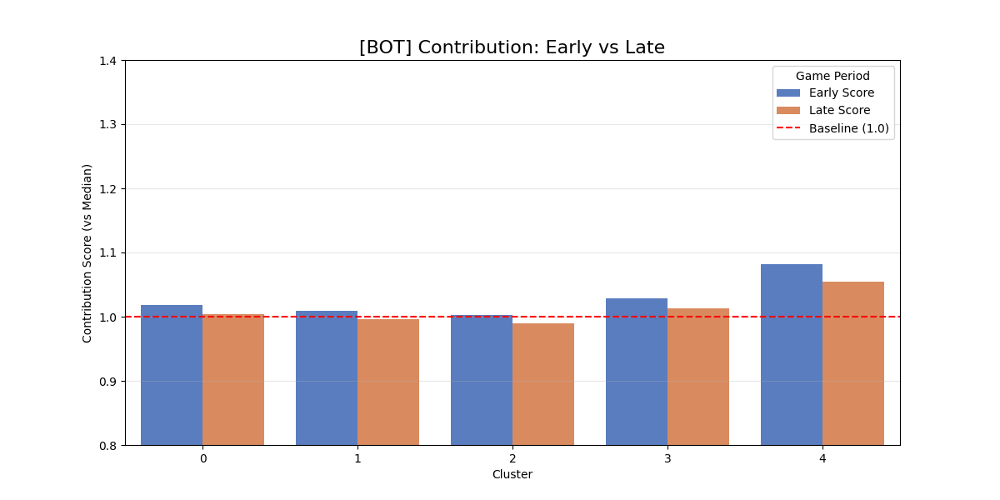

다른 라인들에 비해 바텀은 후반의 기여도가 좀 떨어지는 것으로 보아 서포터의 영향을 받은 것 같다.

# 

##  참고 문헌 및 데이터 근거

- Riot Games Official Developer API Docs (Match Timeline V5)  
- [Riot Data Science Blog - “Gold and Experience as Predictors of Match Outcome”](https://engineering.riotgames.com/)  
- OP.GG & U.GG Performance Metrics (Champion-based Statistics)  
- TensorFlow Time Series Analysis Guide (LSTM 적용 근거)
- microsoft LightGBM guide
